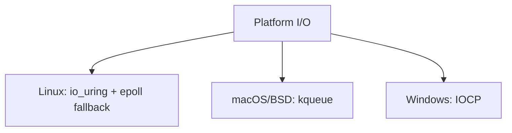

# Context Pack: Platform I/O

Reference architecture: [design/2.0-architecture.md](../design/2.0-architecture.md).
Reference contracts: [design/1.4-contracts.md](../design/1.4-contracts.md).
Reference core runtime: [design/3.0-core-runtime.md](../design/3.0-core-runtime.md).

## Scope

This pack covers event loops, socket lifecycle, and cross-platform I/O abstraction for the server runtime.

## Hard Invariants

- No per-request heap allocation on the steady-state path. See [design/1.3-invariants.md](../design/1.3-invariants.md).
- Backpressure must be enforced on reads and writes. See [design/1.3-invariants.md](../design/1.3-invariants.md).
- Timeouts must be enforced for idle, header, body, and write phases. See [design/1.3-invariants.md](../design/1.3-invariants.md).

## Supported Backends

## Responsibilities

- Accept connections and register them with the event loop.
- Deliver read/write readiness or completion events to the connection state machine.
- Apply socket options consistently across platforms.
- Surface I/O errors using canonical categories.

## Inputs and Outputs

See [design/1.4-contracts.md](../design/1.4-contracts.md) for full tables.

## Non-goals

- Implementing TLS, HTTP parsing, or application routing.
- Defining deployment or OS-specific installer behavior.
