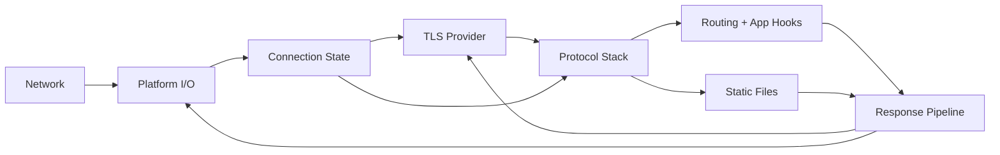
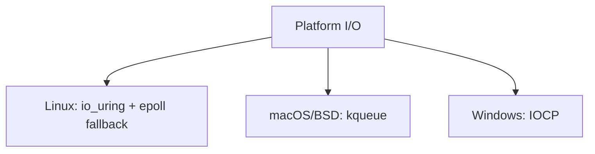

# Zig Webserver Design

## Scope

This spec defines the architecture, invariants, and validation criteria for a cross-platform, production-grade webserver implemented in Zig with minimal dependencies.

## Goals

- Provide HTTP/1.1, HTTP/2, and HTTP/3 support behind a single server binary.
- Maximize throughput and minimize tail latency under high concurrency.
- Run on Linux, macOS, BSD, and Windows with platform-optimized I/O backends.
- Keep the core runtime dependency-free beyond Zig standard library.
- Allow optional TLS and QUIC backends via build-time feature flags.
- Support reverse proxy mode with upstream connection pooling, load balancing, and health checks.

## Non-goals

- Re-implementing TLS or QUIC from scratch.
- Providing a full framework for application business logic.
- Bundling deployment tooling or platform-specific installers.

## Architecture Overview

## Component Responsibilities

- Platform I/O: event-driven non-blocking I/O with per-OS backends.
- Connection State: per-socket state machines; lifecycle and timeouts.
- TLS Provider: optional transport encryption, ALPN, and record handling.
- Protocol Stack: HTTP/1.1 parser; HTTP/2 framing + HPACK; HTTP/3 via QUIC backend.
- Routing + App Hooks: structured request dispatch and middleware chain.
- Reverse Proxy: upstream selection, header manipulation, and request forwarding.
- Upstream Pool: backend connection management, load balancing, and health checks.
- Static Files: zero-copy file transfer and cache hints.
- Response Pipeline: batching, vectored writes, and backpressure handling.

## Platform I/O Backends

## Protocol Stack

- HTTP/1.1 must be fully compliant with keep-alive, pipelining, and strict parsing.
- HTTP/2 must implement stream multiplexing, HPACK, and flow control.
- HTTP/3 must be isolated behind a QUIC backend interface and feature flag.
- TLS must be provided by a pluggable provider interface; core must not depend on TLS.

## Build Flags

Enable optional features at build time:

- `zig build -Denable-tls`
- `zig build -Denable-http2`
- `zig build -Denable-http3`
- `zig build -Denable-proxy`

Defaults: all flags are disabled unless explicitly set.

Recommended combinations:

- `-Denable-tls -Denable-http2` for production TLS + HTTP/2.
- `-Denable-tls -Denable-http2 -Denable-http3` when QUIC is available.
- `-Denable-proxy` for reverse proxy mode (combinable with protocol flags).
- `-Denable-tls -Denable-http2 -Denable-proxy` for a production reverse proxy.
- No flags for a minimal HTTP/1.1-only build.

Constraints:

- HTTP/3 requires QUIC and TLS; enable `-Denable-http3` only when the QUIC/TLS provider is available.
- Proxy mode operates independently of protocol flags; upstream connections use HTTP/1.1 by default.

## Validation

- Unit tests must cover HTTP parsing, header validation, and state transitions.
- Integration tests must verify HTTP/1.1, HTTP/2, and HTTP/3 request/response flows.
- Integration tests must verify reverse proxy forwarding, failover, and load balancing.
- Load tests must define target concurrency and document throughput and latency baselines.
- Load tests must measure proxy overhead vs direct connection.
- Fuzz tests must target HTTP/1.1 parsing and HPACK decoding.
- Chaos tests must verify proxy behavior under upstream failures.

## Related

- [1.3-invariants.md](1.3-invariants.md)
- [1.4-contracts.md](1.4-contracts.md)
