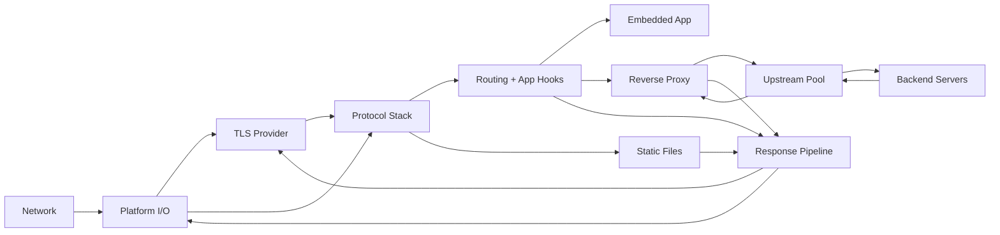
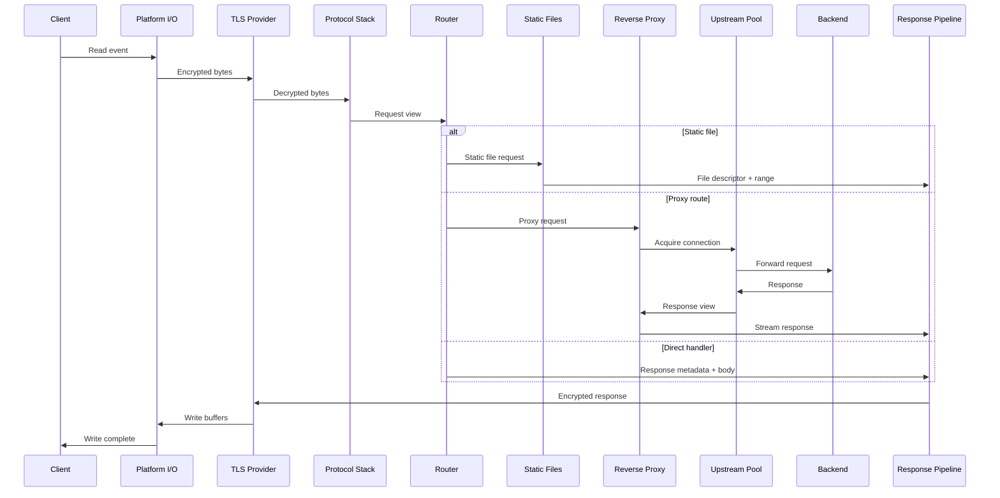
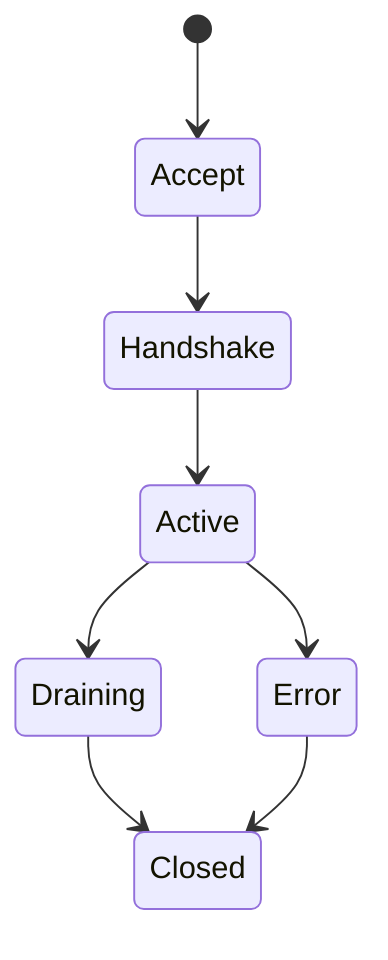

# Architecture

Reference entry point: [1.0-intro.md](1.0-intro.md).

## System Overview

## Data Flow

## Connection State Machine

## Process and Listener Model

- A single server runs as N worker processes under a fork manager (`master.zig`),
  one per CPU by default (`cfg.workers` overrides; `workers == 1` runs
  single-process with no fork). Each worker binds the same ports with
  `SO_REUSEPORT`, so the kernel distributes connections across workers without
  userspace coordination.
- Each worker process can bind **multiple** TCP ports simultaneously
  (`server.listeners_buf[]` / `BoundListener`), each carrying its own protocol
  config (`config.ListenerConfig`): plaintext HTTP/1.1, h2c-only, or TLS HTTP/1.1+HTTP/2
  via ALPN, plus an optional QUIC/HTTP/3 endpoint over UDP. A single legacy
  `address`/`port` config is treated as a one-element listener set.
- Per-connection protocol is resolved **at accept** from `getsockname` (the local
  port) → the matching `ListenerConfig` (see `accept.zig`), so the I/O backends stay
  unaware of per-port protocol differences.
- Platform I/O selects one of four event-loop backends at runtime: `kqueue`
  (macOS/BSD), `epoll` (Linux), `io_uring_poll`, and `io_uring_native` (modern
  Linux).

## Subsystem Boundaries

- Platform I/O owns event loops, socket lifecycle, and readiness notifications.
- TLS Provider owns handshake, ALPN, and record encryption/decryption when enabled.
- Protocol Stack owns HTTP parsing, stream state, and flow control.
- Router owns handler selection, middleware, and request context.
- Reverse Proxy owns upstream selection, connection pooling, and request forwarding.
- Upstream Pool owns backend connections, health tracking, and load balancing.
- Response Pipeline owns buffer batching, chunking, and write completion.

## Failure Handling

- I/O errors map to canonical categories and trigger connection shutdown.
- TLS errors terminate the connection with appropriate alerts.
- Protocol errors return correct status codes and close on violation.
- Timeouts move connections to Draining and then Closed.

## Performance Mechanisms

- Per-core accept loops with `SO_REUSEPORT` where supported.
- Vectored writes for header/body aggregation.
- Zero-copy static file transfer via platform primitives.
- Buffer pools with fixed-size slabs and explicit lifetime ownership.

## Related

- [1.3-invariants.md](1.3-invariants.md)
- [1.4-contracts.md](1.4-contracts.md)
