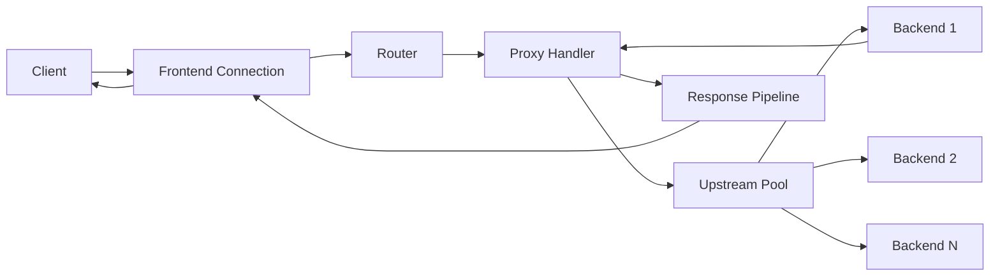
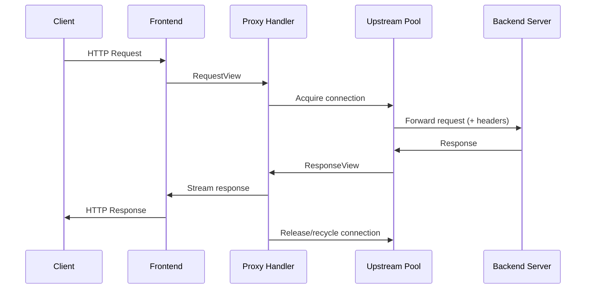
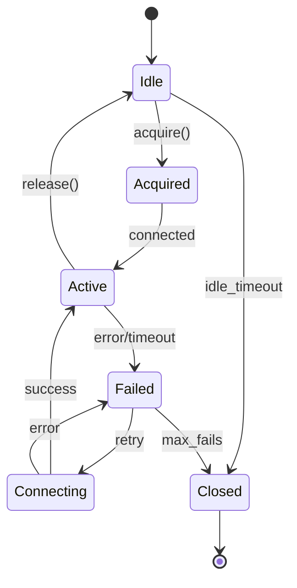
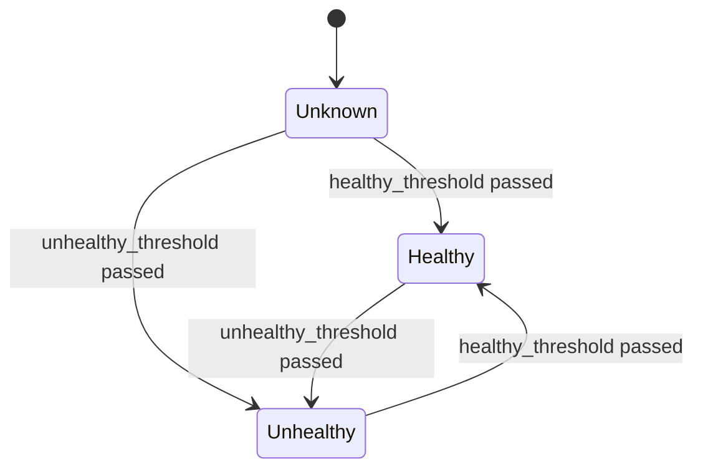

# Reverse Proxy

Reference architecture: [2.0-architecture.md](2.0-architecture.md).
Reference requirements: [1.2-requirements.md](1.2-requirements.md).

## Scope

Defines the architecture, configuration, and behavior for Swerver acting as a reverse proxy, forwarding client requests to upstream servers and relaying responses back to clients.

## Goals

- Forward HTTP/1.1 and HTTP/2 requests to configurable upstream servers.
- Maintain persistent connection pools to upstreams for efficiency.
- Support multiple load balancing strategies.
- Provide health checking and automatic failover.
- Enable request/response header manipulation.
- Preserve zero-copy design where possible.
- Support WebSocket and HTTP upgrade proxying.

## Non-goals

- Caching (separate feature).
- SSL termination to upstreams (initial release uses cleartext upstream; TLS upstream is future work).
- gRPC-specific features beyond standard HTTP/2 proxying.
- Service mesh integration (Envoy territory).

## Architecture Overview



## Data Flow



## Upstream Configuration

### Upstream Definition

```zig
pub const Upstream = struct {
    name: []const u8,
    servers: []const Server,
    load_balancer: LoadBalancer,
    health_check: ?HealthCheck,
    connection_pool: PoolConfig,
};

pub const Server = struct {
    address: []const u8,
    port: u16,
    weight: u16 = 1,
    max_fails: u16 = 3,
    fail_timeout_ms: u32 = 30_000,
    backup: bool = false,
};

pub const PoolConfig = struct {
    max_connections: u16 = 64,
    max_idle: u16 = 16,
    idle_timeout_ms: u32 = 60_000,
    connect_timeout_ms: u32 = 5_000,
};
```

### Load Balancing Strategies

```zig
pub const LoadBalancer = union(enum) {
    round_robin: void,
    least_conn: void,
    ip_hash: void,
    random: void,
    weighted_round_robin: void,
};
```

| Strategy | Description |
|----------|-------------|
| `round_robin` | Rotate through servers sequentially |
| `least_conn` | Select server with fewest active connections |
| `ip_hash` | Consistent hashing based on client IP |
| `random` | Random selection with optional weights |
| `weighted_round_robin` | Round-robin respecting server weights |

## Proxy Handler

### Location Matching

Proxy routes are matched by path prefix and optional host:

```zig
pub const ProxyRoute = struct {
    path_prefix: []const u8,
    host: ?[]const u8 = null,
    upstream: []const u8,
    rewrite: ?RewriteRule = null,
    headers: HeaderRules = .{},
    timeouts: ProxyTimeouts = .{},
};

pub const RewriteRule = struct {
    pattern: []const u8,
    replacement: []const u8,
};
```

### Header Manipulation

```zig
pub const HeaderRules = struct {
    /// Headers to add/set on forwarded request
    set_request: []const Header = &.{},
    /// Headers to remove from forwarded request
    remove_request: []const []const u8 = &.{},
    /// Headers to add/set on returned response
    set_response: []const Header = &.{},
    /// Headers to remove from returned response
    remove_response: []const []const u8 = &.{},
    /// Add standard proxy headers (X-Forwarded-For, etc.)
    add_proxy_headers: bool = true,
    /// Preserve Host header from client
    preserve_host: bool = false,
};
```

### Standard Proxy Headers

When `add_proxy_headers` is true, the following headers are added to upstream requests:

| Header | Value |
|--------|-------|
| `X-Forwarded-For` | Client IP (appended if exists) |
| `X-Forwarded-Proto` | `http` or `https` |
| `X-Forwarded-Host` | Original Host header |
| `X-Real-IP` | Client IP |
| `Via` | `1.1 swerver` |

### Timeouts

```zig
pub const ProxyTimeouts = struct {
    connect_ms: u32 = 5_000,
    send_ms: u32 = 30_000,
    read_ms: u32 = 60_000,
    /// Total time for entire proxy operation
    total_ms: u32 = 120_000,
};
```

## Upstream Connection Pool

### Pool State Machine



### Connection Lifecycle

```zig
pub const UpstreamConnection = struct {
    server: *Server,
    fd: std.posix.fd_t,
    state: ConnectionState,
    created_ms: u64,
    last_used_ms: u64,
    requests_served: u32,
    protocol: Protocol,

    pub const ConnectionState = enum {
        connecting,
        idle,
        active,
        draining,
        failed,
    };
};
```

### Pool Operations

- **acquire()**: Get available connection or create new one (up to max).
- **release()**: Return connection to idle pool or close if draining.
- **evict()**: Remove failed or expired connections.
- **health_check()**: Periodic probe of idle connections.

### Connection Reuse

HTTP/1.1 connections are reused when:
- Response has `Connection: keep-alive` (or HTTP/1.1 default)
- Response is fully consumed
- No errors occurred
- Connection has not exceeded `max_requests` (if configured)

HTTP/2 connections multiplex streams:
- Single connection per upstream server
- Stream limits respected per SETTINGS
- GOAWAY triggers graceful connection replacement

## Health Checking

### Passive Health Checks

Enabled by default. Tracks failures per server:

```zig
pub const PassiveHealthState = struct {
    consecutive_failures: u16 = 0,
    last_failure_ms: u64 = 0,
    available: bool = true,
};
```

Server marked unavailable when:
- `consecutive_failures >= max_fails`
- Stays unavailable for `fail_timeout_ms`
- Then re-enabled and counter reset

### Active Health Checks

Optional periodic probing:

```zig
pub const HealthCheck = struct {
    interval_ms: u32 = 5_000,
    timeout_ms: u32 = 2_000,
    path: []const u8 = "/health",
    expected_status: u16 = 200,
    expected_body: ?[]const u8 = null,
    healthy_threshold: u16 = 2,
    unhealthy_threshold: u16 = 3,
};
```

### Health Check State Machine



## Request Forwarding

### Zero-Copy Forwarding

Where possible, request bodies are forwarded without buffering:

1. Client sends request with `Content-Length` or chunked encoding
2. Proxy acquires upstream connection
3. Proxy streams request headers (modified)
4. Proxy streams body chunks directly to upstream
5. No intermediate buffering for bodies

### Buffering Mode

Full request buffering required when:
- Request body must be retried (non-idempotent with retry enabled)
- Body transformation is configured
- Upstream requires Content-Length but client sent chunked

### Request Forwarding Rules

1. Remove hop-by-hop headers: `Connection`, `Keep-Alive`, `Proxy-Authenticate`, `Proxy-Authorization`, `TE`, `Trailer`, `Transfer-Encoding`, `Upgrade` (except for WebSocket)
2. Apply header rules from configuration
3. Set appropriate `Host` header (upstream server or preserved)
4. Add proxy headers if enabled

## Response Handling

### Streaming Response

1. Read response headers from upstream
2. Apply response header rules
3. Stream response headers to client
4. Stream body chunks to client as received
5. Handle trailers if present

### Error Responses

| Condition | Status | Action |
|-----------|--------|--------|
| No healthy upstreams | 502 | Return error page |
| Connect timeout | 504 | Try next server or return error |
| Read timeout | 504 | Return error page |
| Upstream 5xx | Pass through | Optionally retry |
| Connection reset | 502 | Try next server or return error |

## Retry Logic

### Idempotent Retry

Safe methods (`GET`, `HEAD`, `OPTIONS`) retry on:
- Connection failure
- Connect timeout
- 502, 503, 504 response (if configured)

### Retry Configuration

```zig
pub const RetryConfig = struct {
    max_retries: u8 = 1,
    retry_statuses: []const u16 = &.{ 502, 503, 504 },
    retry_methods: []const []const u8 = &.{ "GET", "HEAD", "OPTIONS" },
    retry_non_idempotent: bool = false,
};
```

### Circuit Breaker

Optional circuit breaker pattern:

```zig
pub const CircuitBreaker = struct {
    enabled: bool = false,
    failure_threshold: u16 = 5,
    success_threshold: u16 = 2,
    timeout_ms: u32 = 30_000,
    half_open_requests: u8 = 1,
};
```

States: `closed` → `open` → `half_open` → `closed`

## WebSocket Proxying

### Upgrade Handling

1. Detect `Upgrade: websocket` header
2. Forward upgrade request to upstream
3. On 101 response, switch to tunnel mode
4. Bidirectional byte forwarding (no HTTP framing)
5. Close tunnel on either side disconnect

### WebSocket Configuration

```zig
pub const WebSocketConfig = struct {
    enabled: bool = true,
    ping_interval_ms: u32 = 30_000,
    max_message_size: usize = 64 * 1024,
};
```

## HTTP/2 Upstream

### Protocol Selection

```zig
pub const UpstreamProtocol = enum {
    http1_only,
    http2_only,
    http1_prefer,
    http2_prefer,
    auto,
};
```

- `auto`: Use ALPN if TLS, otherwise HTTP/1.1
- `http2_prefer`: Try HTTP/2 with fallback to HTTP/1.1
- `http2_only`: Fail if HTTP/2 not supported

### HTTP/2 Considerations

- Single connection per upstream (multiplexed)
- Map client stream to upstream stream
- Forward flow control signals
- Handle GOAWAY gracefully

## Observability

### Metrics

| Metric | Type | Description |
|--------|------|-------------|
| `proxy_requests_total` | Counter | Total proxied requests |
| `proxy_request_duration_ms` | Histogram | End-to-end latency |
| `upstream_connect_duration_ms` | Histogram | Connection establishment time |
| `upstream_connections_active` | Gauge | Current active connections |
| `upstream_connections_idle` | Gauge | Current idle connections |
| `upstream_health_status` | Gauge | 1=healthy, 0=unhealthy |
| `proxy_retries_total` | Counter | Retry attempts |
| `proxy_errors_total` | Counter | Proxy errors by type |

### Access Log Fields

Additional fields for proxy requests:
- `upstream_addr`: Selected upstream server
- `upstream_status`: Response status from upstream
- `upstream_response_time`: Time to first byte from upstream
- `upstream_connect_time`: Connection establishment time

## Configuration Example

```zig
const proxy_config = ProxyConfig{
    .upstreams = &.{
        .{
            .name = "api_backend",
            .servers = &.{
                .{ .address = "10.0.0.1", .port = 8080, .weight = 5 },
                .{ .address = "10.0.0.2", .port = 8080, .weight = 3 },
                .{ .address = "10.0.0.3", .port = 8080, .backup = true },
            },
            .load_balancer = .weighted_round_robin,
            .health_check = .{
                .path = "/health",
                .interval_ms = 5000,
            },
            .connection_pool = .{
                .max_connections = 100,
                .max_idle = 20,
            },
        },
    },
    .routes = &.{
        .{
            .path_prefix = "/api/",
            .upstream = "api_backend",
            .headers = .{
                .add_proxy_headers = true,
                .set_request = &.{
                    .{ .name = "X-Request-ID", .value = "$request_id" },
                },
            },
            .timeouts = .{
                .connect_ms = 3000,
                .read_ms = 30000,
            },
        },
    },
    .retry = .{
        .max_retries = 2,
        .retry_statuses = &.{ 502, 503, 504 },
    },
};
```

## Implementation Files

| File | Responsibility |
|------|----------------|
| `src/proxy/proxy.zig` | Main proxy handler |
| `src/proxy/upstream.zig` | Upstream definitions |
| `src/proxy/pool.zig` | Connection pool management |
| `src/proxy/balancer.zig` | Load balancing algorithms |
| `src/proxy/health.zig` | Health check logic |
| `src/proxy/forward.zig` | Request/response forwarding |
| `src/proxy/websocket.zig` | WebSocket tunnel handling |

## Build Flag

Enable reverse proxy at build time:

```bash
zig build -Denable-proxy
```

When disabled, all proxy code is excluded from the binary.

## Invariants

1. Upstream connections must be returned to pool or closed; never leaked.
2. Client must receive a response even if all upstreams fail.
3. Hop-by-hop headers must never be forwarded.
4. Health check failures must not block request handling.
5. Connection pool must respect configured limits.
6. Retry must not occur for non-idempotent methods unless explicitly configured.
7. WebSocket upgrade must be atomic (no partial state).

## Validation

- Unit tests for load balancing algorithms.
- Unit tests for header manipulation.
- Integration tests for request forwarding.
- Integration tests for failover behavior.
- Integration tests for WebSocket proxying.
- Load tests measuring proxy overhead vs direct connection.
- Chaos tests for upstream failure scenarios.

## Related

- [3.1-connection-lifecycle.md](3.1-connection-lifecycle.md)
- [3.3-backpressure-timeouts.md](3.3-backpressure-timeouts.md)
- [3.7-protocol-handoff.md](3.7-protocol-handoff.md)
