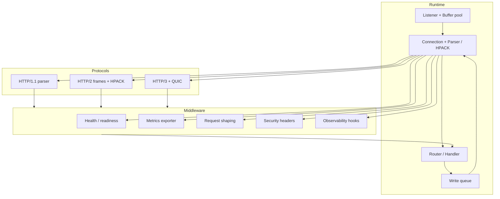

# Middleware Design

Middleware is opt-in logic that can run before the request hits the router and after responses stream back. The goal is to keep the runtime minimal while exposing high-value policy hooks (health, metrics, request shaping, security, observability, payments) across every protocol. Each middleware should:

- work without heap allocations in the hot path;
- expose per-connection/state hooks so HTTP/1.1, HTTP/2, and HTTP/3 share the same behavior;
- be opt-in via configuration flags or router wiring.

## Health + Readiness

- Liveness: `GET /.healthz` responds with `200 OK` (headers only). If TLS/HTTP/2 is enabled, the same endpoint must work over those transports (responding over a stream or ALPN-ed connection).
- Readiness: `GET /.ready` returns `200 OK` only if the runtime is healthy (listeners bound, buffer pools sized, TLS handshakes completed). Otherwise it returns `503`.
- No body for probes; content-length zero and no chunked encoding.
- Responses should be cached per connection/session for performance.

## Metrics / Exporter

- Gather counters/timers for requests, responses, latency (header/body timeframe), errors, and queue depth.
- Expose `/metrics` as Prometheus-compatible text with zero heap allocations: use a fixed `MetricRecord` ring buffer for counters and emit the latest values.
- Metrics middleware must be aware of HTTP/2 multiplexing and tag each output with the protocol and stream in the exposition when applicable (`protocol="http/2"`).
  The existing implementation already captures stream IDs (see `StreamMetrics`), so the export includes `stream_id` labels when a stream is active.
- Hooks should also emit summary attributes to the structured log middleware.

## Request Shaping / Rate Limiting

- Track per-IP/per-stream quotas via connection metadata.
- On violation return `429 Too Many Requests` for HTTP/1.1 and HTTP/2 stream errors (FLOW_CONTROL or REFUSED_STREAM depending on timing) or `HTTP/3` equivalent.
- Provide a token bucket implementation that integrates with backpressure (pauses reads when bucket empty, resumes when tokens refill).
- Expose weights for `x402` and premium routes so shaping logic can treat them differently.
  The structured plan is:
  1. Middleware updates a `BackpressureInfo` struct with `pause_reads`/`resume_after_ms` decisions.
  2. The router reports those decisions to the server, which toggles `connection.read_paused`.
  3. A timer resumes reading once tokens refill, keeping the connection’s backpressure state in sync with the limiter.
  This pipeline allows the runtime to skip reads on paused sockets and gracefully resume once capacity exists.

## Security Headers & Policy

- Inject CSP, HSTS, Referrer-Policy, and CORS headers before responses leave the router.
- Support route-level overrides (e.g., HSTS only for TLS).
- Reject requests missing `Host`/`:authority` for HTTP/1.1+2; this is already in parser, but middleware must log/metric these events.
- Optionally enforce `PAYMENT-SIGNATURE` for protected routes (the existing x402 middleware can plug in here).

## Observability Hooks

- Emit structured traces/contexts per request/stream with start/end timestamps, status codes, and tags such as `protocol`, `stream_id`, `route`.
- Include `request_id` from headers and propagate via outgoing headers (`Request-Id`).
- Provide a `logging` hook that can format events without heap allocations (preallocated buffer + fmt).
- Allow middleware to register `onExit` callbacks for congestion alerts or eBPF counters.
  The current `observability` middleware includes `OnExitFn` registration and an `EbpfCounters` helper so eBPF programs can consume aligned counters or fallback to an in-memory implementation.

## Minimal Dependencies

- Prefer Zig standard library features; avoid pulling in C libs unless absolutely necessary (e.g., eBPF tooling can live in a separate build step).
- Middleware should be pluggable via Zig interfaces (`fn middleware(conn: *Connection, view: RequestView)`) and optionally reused by HTTP/2/3 stacks.
- Document feature flags and how they affect the hot request path.

## Architecture Diagram

